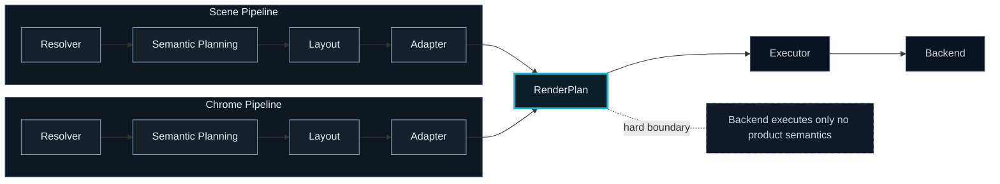
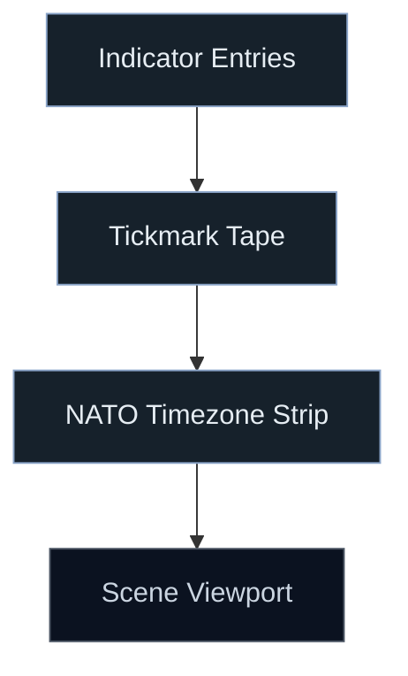
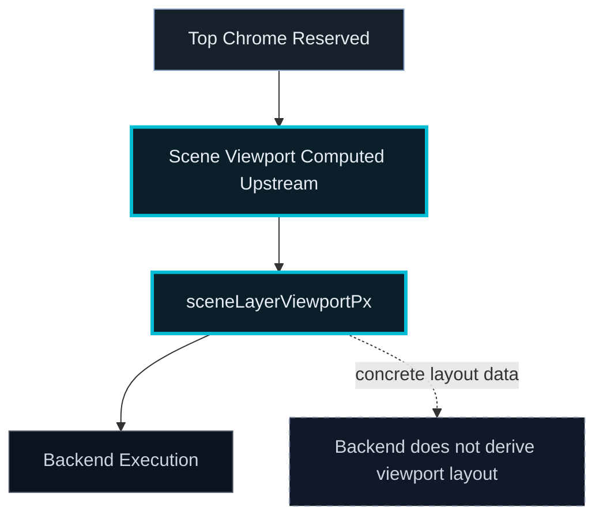
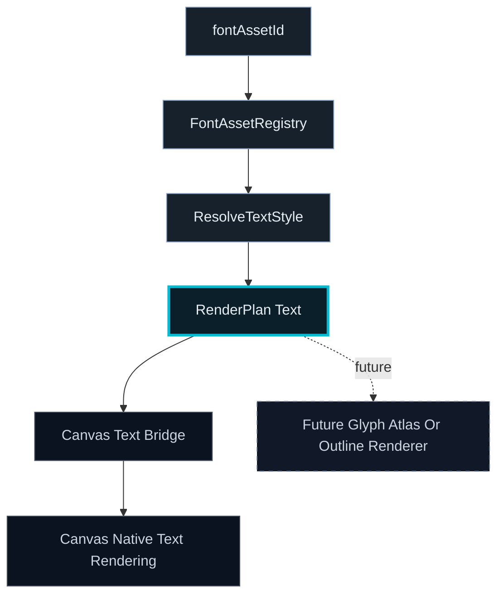
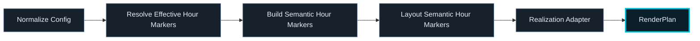
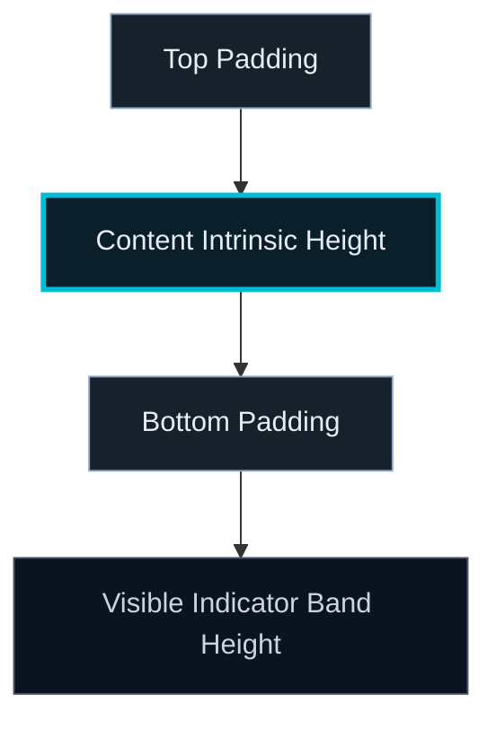
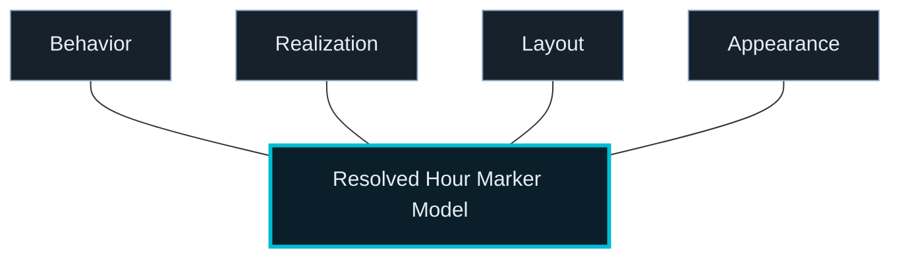

# Architecture

## Architectural Intent

Libration is a precision-rendered world time instrument built on a **render-plan-driven architecture**.

All visual output is expressed as explicit render intent (`RenderPlan`) before backend execution.

Core goals:
- Renderer-agnostic rendering semantics
- Deterministic visual output
- Strict separation of concerns
- High perceptual fidelity
- Future multi-backend support (Canvas, GPU)
- Clear separation between representation, semantic planning, layout, execution, and persistence intent

Libration resolves rendering intent upstream and emits a backend-agnostic `RenderPlan` for execution.

---

## Top-Level Subsystems

### 1. App Shell
Owns:
- UI state
- preset selection
- config lifecycle
- render loop orchestration

Produces:
- `SceneRenderInput`

---

### 2. Core Model
Pure domain logic:
- time context
- solar/lunar math
- projection

Renderer-agnostic and deterministic.

---

### 3. RenderPlan System (CORE)

All rendering flows through:

**Resolvers / Plan Builders → Semantic Planning → Layout → RenderPlan → Executor**

`RenderPlan` remains backend-neutral and is the only rendering intent consumed by execution.

Current shared primitive surface includes:
- rect
- line
- text
- path2d
- gradients
- rasterPatch
- imageBlit

Path items support explicit payload identity:
- descriptor-backed path payloads for shared intent
- transitional `Path2D` payloads where still needed
- descriptor-backed or `Path2D` clip payloads

Scene and chrome resolve independently upstream, converge at `RenderPlan`, and only then pass into backend execution.

---

### 4. Renderer Backend

`CanvasRenderBackend` owns execution only.

Canvas-specific realization is isolated behind bridge modules:
- `canvasTextFontBridge`
- `canvasPaintBridge`
- `canvasPathBridge`
- bundled Canvas font loading / registration helpers

Future renderers must consume the same upstream intent without introducing product semantics.

---

### 5. Display Chrome

The display chrome is a **screen-space instrument system**, not part of layers.

Current top-band design:
- Hour markers
- Tickmark tape (hour / 15 / 5 hierarchy)
- NATO timezone strip (rectangular, continuous band)
- Fixed built-in top chrome styling (single token set in config; not user-selectable)
- Fully RenderPlan-driven
- The scene viewport is derived upstream and begins below the reserved top chrome; the backend consumes that resolved viewport rather than deriving chrome offsets

Top chrome reserves real layout space. The scene viewport begins strictly below the visible chrome stack.

The scene viewport is resolved upstream and handed to the backend as concrete layout data.

Top-band major areas now expose independent visibility controls for:
- 24-hour indicator entries
- 24-hour tickmark tape
- NATO timezone row

The 24-hour indicator entries area now has its own structured strip-scoped presentation controls:
- authored strip background color intent in config
- resolver-derived contrast foreground selection for strip text/ink
- optional noon/midnight customization for indicator-entry presentation only
- strip-only noon/midnight realization variants:
  - `NOON` / `MID`
  - highlighted `12`
  - sun / moon pictograms
  - semantic diamond glyphs

Recent chrome simplification:
- hour-marker circle backgrounds have been removed from the top-band render plan
- broad tape-level `NOON` / `MIDNIGHT` annotations are no longer emitted as a separate legacy pass
- marker placement, timing, and tape alignment remain unchanged

Chrome is:
- visually integrated
- architecturally separate from layers
- free to evolve representation styles without changing the time model

---

## Chrome Representation Direction

The top band no longer uses a single fixed numeric style.

Top-band hour markers now use a truthful split:
- **Text** → selected bundled font asset + styling
- **Procedural glyph** → selected glyph mode + styling

These fall into two major categories:

### A. Font-backed representations
Examples currently in inventory/use:
- Zeroes One
- Zeroes Two
- DSEG7Modern-Regular
- DotMatrix-Regular
- COMPUTER
- Flip Clock
- Kremlin

These are integrated through a renderer-agnostic font asset / typography system.

### B. Procedural representations
Implemented modes:
- Analog clock faces
- Radial wedge
- Radial line

These are **not fonts**. They are symbolic glyph modes rendered from primitives.

---

## Typography and Glyph Architecture

The system distinguishes between:

- **Font assets** — packaged font resources with stable IDs
- **Typography roles** — semantic uses of text, not raw file references
- **Representation kind** — whether a surface is using text or procedural glyphs
- **Procedural glyphs** — non-font symbolic renderables built from primitives
- **Style** — appearance controls layered on top of representation and asset choice

### Architectural Rule

> Font files are assets.
>
> Typography is a semantic system.
>
> Glyph modes are representation choices.
>
> Style is layered on top.
>
> Backends only realize already-resolved intent.

This keeps the system compatible with:
- current Canvas execution
- future native / RTX execution
- deterministic layout and rendering behavior

---

## Font Pipeline Status

The current font preprocessing pipeline produces:
- `fontAssetDb.json`
- `fontAssetManifest.json`
- stable font asset IDs
- extracted metadata / metrics

It does **not** currently produce:
- glyph outline datasets
- per-character path command tables
- bitmap or SDF atlases
- renderer-owned glyph geometry caches

### Runtime Meaning Today

At runtime the live text path is:

`fontAssetId → FontAssetRegistry → TypographyRole / resolveTextStyle → RenderPlan text item → Canvas text bridge → Canvas native text rendering`

So the current system is:
- **font-identity-aware**
- **typography-role-aware**
- **renderer-agnostic at the planning level**

But it is **not yet a custom glyph-shape rendering runtime**.

Canvas still performs final text rasterization in the current backend.

---

## Top-Band Hour Marker Runtime Architecture (CURRENT)

Top-band hour-marker rendering uses a strict semantic pipeline.

### Authoritative runtime flow

`normalize hourMarkers config → resolveEffectiveTopBandHourMarkers → buildSemanticTopBandHourMarkers → layoutSemanticTopBandHourMarkers / realization-specific layout → realization adapter → RenderPlan`

Implemented semantic realizations:
- text
- analogClock
- radialLine
- radialWedge

Strip-scoped noon/midnight customization is modeled as an additional semantic presentation overlay on top of these realizations rather than as a backend concern.

### Important status

- The semantic pipeline is now the **only supported runtime path** for in-disk top-band hour markers.
- The old tape-column fallback path has been removed.
- Runtime now requires full semantic inputs for the supported path.
- Tests use shared semantic fixtures instead of degraded single-marker fallback behavior.

### Runtime contract

For in-disk top-band hour markers, the supported contract is:
- structured `chrome.layout.hourMarkers` present in normalized config
- full 24-marker input after semantic planning
- realization consistent with selection
- analog clock additionally requires:
  - `referenceNowMs`
  - `structuralZoneCenterXPx` with 24 entries

This means the current app runtime has one authoritative implementation rather than parallel semantic and fallback paths.

### Hour-marker disk row: vertical content model (FINAL)

The **content row** is the vertical slice allocated to hour-disk interiors inside the top-band indicator strip. One canonical pipeline applies to text and procedural glyph realizations.

**Scale vs spacing (authoritative split)**

- **Scale** — hour-marker `sizeMultiplier`, normal width/fit rules, and realization-specific intrinsic sizing determine marker scale. Padding must never influence intrinsic content height, radius, label size, or glyph size.
- **Spacing** — `contentPaddingTopPx` / `contentPaddingBottomPx` change only the visible indicator-band height and vertical placement inside that band.

**Total Height = intrinsic content height + top padding + bottom padding**

Padding affects spacing only. It must never influence intrinsic text size, glyph size, radius, or fitted marker geometry.

**Intrinsic content height**

- **Text** — resolved once on the product path by the top-band text intrinsic resolver: prefer Canvas `measureText` ink height when a 2D context exists; otherwise use deterministic typography (`lineHeightPx` or font-size × em).
- **Glyphs** — derived from fitted head-disk geometry via `hourCircleHeadMetrics` / `resolveHourMarkerDiskRowIntrinsicContentHeightPx`.

**Padding and row math**

- `resolveHourMarkerContentRowPaddingPx` and `computeHourMarkerContentRowVerticalMetrics` define Auto padding and allocated row height.
- **Auto** is intrinsic-proportional per side when omitted; it is not derived from leftover strip slack.
- Allocated row height is:
  - `paddingTop + intrinsic + paddingBottom`

**Visible indicator band height**

The product chrome path solves the visible 24-hour indicator band directly from:
- intrinsic content height
- resolved top padding
- resolved bottom padding

There is no separate slack-split or “padded row converges to a fixed disk strip” stage in the final model.

**Separation of concerns**

- intrinsic acquisition happens upstream of semantic layout
- padding resolution and row math live in the vertical-metrics module
- `topBandHourMarkersLayout.ts` places disk-row centers using shared row metrics
- render plans consume the same resolved inputs

Do not reintroduce implicit padding derived from legacy head-disk Y hacks or any path where padding changes scale.

---

## Behavioral / Representation Model

For top-band hour markers, the runtime and editor now distinguish explicit persisted and derived concerns.

Persisted/editor-facing axes:
- **Behavior** — e.g. `tapeAdvected`, `staticZoneAnchored`
- **Realization** — text, analogClock, radialLine, radialWedge
- **Layout** — size and placement semantics, including content-row padding
- **Appearance** — realization-specific appearance controls
- **Indicator-entry strip controls** — strip background intent plus optional noon/midnight customization for the upper 24-hour entries area

Derived runtime concern:
- **Content** — e.g. `hour24`, `localWallClock`

This means `content` remains part of semantic runtime modeling, but it is no longer treated as a persisted/editor-owned axis for hour markers.

---

## Structured Persistence Model

Hour markers now persist through a single structured config surface:

`chrome.layout.hourMarkers`

This structured model is authoritative for:
- editor authoring
- normalization
- runtime resolution
- persistence

It now also carries strip-scoped indicator-entry concerns such as:
- indicator entries area background color intent
- resolver-derived effective foreground usage downstream of that background
- optional `noonMidnightCustomization` with bounded expression modes

Legacy flat hour-marker persistence fields have been removed.

That means:
- no dual config truth remains for hour markers
- no flat compatibility regeneration remains
- old saved configs that only used flat hour-marker fields are no longer compatible

---

## Recommended Shared Abstractions

### Font Asset Layer
Owns:
- logical font IDs
- runtime manifest
- asset metadata
- backend loading / realization hooks

### Typography Role Layer
Owns semantic roles such as:
- chromeHourPrimary
- chromeHourEmphasis
- chromeZoneLabel
- chromeDenseMono
- chromeSegment
- chromeDotMatrix

### Representation Layer
Owns surface-specific representation choice.

For top-band hour markers:
- text with a selected bundled font asset
- procedural glyph with a selected glyph mode

### Procedural Glyph Layer
Owns symbolic glyph generation via primitives.

Examples:
- circle + hand(s) for analog clock
- arc/wedge for radial wedge
- center-out line for radial line

### Style Layer
Owns appearance controls layered over representation:
- size
- realization-scoped color and fill/stroke controls
- future realization-specific and multi-channel controls

---

## Layout vs Rendering Rule

Chrome layout must not become dependent on backend-specific font behavior.

That means:
- sector/grid placement stays structural
- semantic planning resolves meaning before primitive emission
- measurement is an explicit capability, not implicit browser behavior
- procedural glyphs obey the same layout contract as text-based markers
- backends do not infer behavior, realization choice, or content semantics

---

## Architectural Status

Renderer-agnostic architecture is COMPLETE enough for feature-forward work.

Top-band hour-marker runtime migration is COMPLETE for the current production path.

Hour-marker editor and persistence migration are COMPLETE for the current production path.

Typography / glyph subsystem is FUNCTIONAL and in active use.

### What is implemented
- font asset preprocessing + runtime manifest
- typography role resolution
- TextGlyph + procedural glyph unification
- top-band hour-marker text/glyph split
- semantic hour-marker resolver / planner / layout / realization adapters
- semantic-only runtime path for in-disk hour markers
- structured `chrome.layout.hourMarkers` persistence
- dedicated `HourMarkersEditor` with canonical section structure: Behavior / Realization / Appearance / Layout
- content-row top/bottom padding controls for the indicator band
- independent `tickTapeVisible` / `timezoneLetterRowVisible` top-band visibility controls
- structured-only hour-marker authoring, normalization, and runtime consumption
- top-band and bottom-chrome policy integration
- renderer-agnostic scene viewport derivation (`sceneLayerViewportPx`) passed to backends as resolved layout data
- backend-neutral text identity (`font.assetId`)
- explicit Canvas bridge modules for text, paint, and paths
- Canvas bundled-font loading/registration at runtime
- descriptor-backed path and clip support

### What is not yet implemented
- renderer-owned glyph outline rendering from preprocessed font data
- atlas-based custom text rendering
- RTX/native backend
- generalized structured editor/config system across multiple UI surfaces
- broader realization-specific appearance controls beyond the currently implemented hour-marker fields

### Near-Term Work
- continue feature-forward top-band chrome and styling work on top of the completed hour-marker architecture
- add new realization-specific appearance controls only when a concrete feature requires them
- apply the same structured editor/persistence pattern to other chrome surfaces only after feature pressure justifies it

### Ongoing Constraints
- No backend-owned product semantics
- No coupling between time model and display style
- No reintroduction of degraded runtime fallback behavior for hour markers
- No resurrection of legacy flat hour-marker persistence
- No speculative architecture churn without feature pressure
