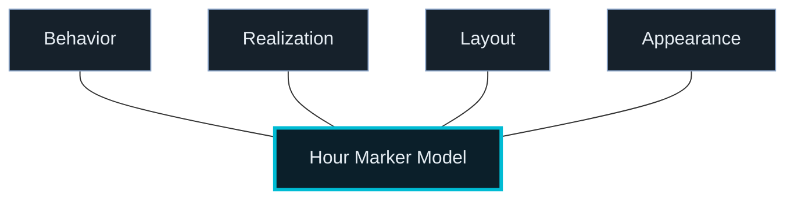
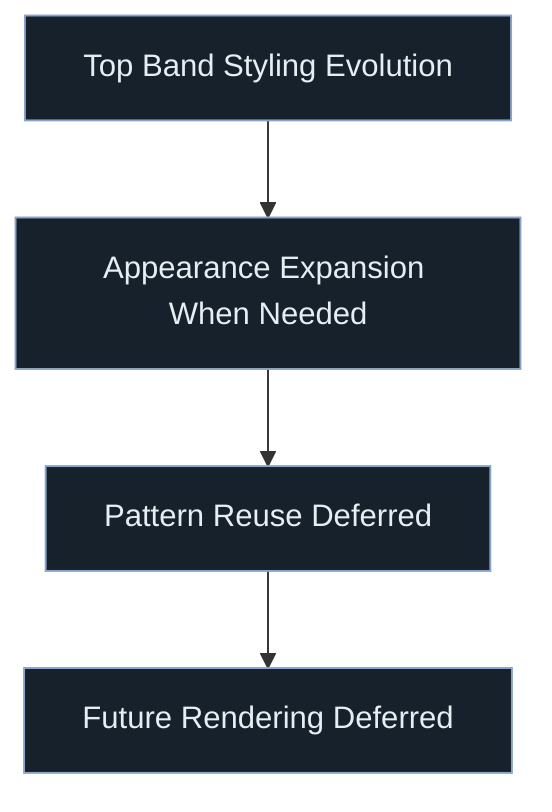

# Project Plan

## Current State

Initial public release: COMPLETE (v1.0.0)  
Architecture: COMPLETE enough for feature-forward work  
Top-band hour-marker runtime migration: COMPLETE for the supported production path  
Hour-marker editor architecture migration: COMPLETE  
Hour-marker persistence migration: COMPLETE  
Typography + glyph subsystem: IMPLEMENTED and usable  
Canvas font realization for bundled font assets: WORKING  
RenderPlan backend-boundary cleanup: COMPLETE enough for the current Canvas path

---

## Current Phase

### Phase: Post-Release Feature Work on Top-Band Chrome

Focus:
- treat the cleaned hour-marker runtime/editor/persistence model as stable
- use `chrome.layout.hourMarkers` as the single authoritative model
- continue top-band visual and feature work without reintroducing migration scaffolding
- preserve renderer-agnostic planning and semantic/runtime separation
- maintain Libration as the canonical public reference implementation of this system

Current truthful top-band model:
- **Realization** → `text`, `analogClock`, `radialLine`, `radialWedge`
- **Derived effective behavior** → `text` resolves to `civilPhased` (read-point–registered phased tape); procedural realizations resolve to `civilColumnAnchored` (structural column centers when anchored)
- **Layout** → size / placement semantics, including content-row padding
- **Appearance** → realization-scoped styling controls
- **Content** → derived semantic runtime concern (`hour24`, `localWallClock`), not a persisted editor axis

Recent completed work:
- extracted `HourMarkersEditor` from `ChromeTab`
- reorganized hour-marker editing around the canonical sections: Realization / Appearance / Layout
- removed authored hour-marker behavior and made effective behavior derived from realization kind
- expanded realization-specific appearance for text, analogClock, radialLine, and radialWedge, including parallel face/ink controls across the three procedural clock modes
- migrated persistence to structured `chrome.layout.hourMarkers`
- removed legacy flat hour-marker fields
- removed the obsolete `customRepresentationEnabled` hour-marker flag
- completed strict config ↔ glyph ↔ renderer layering cleanup and upstream type ownership cleanup
- switched runtime resolution to structured hour-marker input
- introduced Chrome major-area editing for:
  - 24-hour indicator entries
  - 24-hour tickmarks tape
  - NATO timezone area
- added real persisted visibility controls for top-band areas including hour indicators, tick tape, and NATO row
- added persisted content-row top/bottom padding controls for the 24-hour indicator band
- changed upper indicator-entry defaults to a 1.25 size multiplier with 5px top/bottom content-row padding and the Zeroes Two bundled text font
- added authored indicator-entries-area background color with resolver-derived contrast foreground selection
- added structured noon/midnight customization for the upper indicator entries strip with bounded expression modes:
  - `NOON` / `MID`
  - highlighted `12`
  - sun / moon pictograms
  - semantic diamond glyphs
- removed boxed hour numerals on the tick tape for clock/procedural modes
- anchored static procedural clocks to the same reference-city / band-frame present-time basis as the map clock at the present-time tick
- finalized the indicator-band vertical model so visible band height follows intrinsic content height plus resolved padding
- corrected top chrome so it reserves layout space above the scene instead of overlaying map content
- removed the remaining bundled top-strip palette selector and collapsed top chrome to one built-in appearance
- verified that fresh deploys default `AppConfig.data.mode` to `static`
- completed public repo and AGPL licensing
- published the initial public release (`v1.0.0`)

Immediate next target:
- continue incremental top-band feature and styling work using the completed structured model
- continue refining the newer chrome-area editor structure across top-band surfaces without re-monolithizing ChromeTab
- avoid reopening hour-marker migration work unless a concrete bug requires it
- keep public-facing docs, defaults, and licensing posture coherent as the project evolves

---

## Chosen Inventory

### Font-backed
- Zeroes One
- Zeroes Two
- DSEG7Modern-Regular
- DotMatrix-Regular
- COMPUTER
- Flip Clock
- Kremlin

### Procedural
- analogClock
- radialLine
- radialWedge

---

## Runtime Status (Hour Markers)

The hour-marker runtime proving ground is complete enough to stop modifying for architectural reasons.

Implemented production path:
- structured `chrome.layout.hourMarkers`
- `resolveEffectiveTopBandHourMarkers`
- semantic hour-marker planner
- renderer-agnostic layout stage
- realization adapters for:
  - text
  - analogClock
  - radialLine
  - radialWedge
- strict semantic-only runtime contract for in-disk hour markers
- intrinsic-only text/glyph scale path
- intrinsic-based Auto content-row padding
- independent tick tape / NATO row visibility controls

Important consequences:
- no fallback runtime path remains for top-band hour markers
- production uses the semantic path only
- editor, normalization, and runtime now share one authoritative config model
- tests rely on semantic fixtures and structured config, not degraded fallback behavior or flat compatibility fields
- padding no longer influences marker scale

---

## Completed Migration Work

### 1. Editor Boundary
- introduced `HourMarkersEditor`
- moved hour-marker controls out of `ChromeTab`
- kept user-visible behavior stable during the extraction

### 2. Internal Editor Structure
- organized the hour-marker editor around the canonical sections:
  - behavior
  - realization
  - appearance
  - layout

### 3. Model Cleanup and Editor Alignment
- made behavior a first-class optional persisted axis
- expanded realization-specific appearance into structured per-kind `appearance` objects
- canonicalized hour-marker styling onto `appearance` (removed legacy top-level realization color)
- removed the obsolete `customRepresentationEnabled` hour-marker flag
- aligned the editor so every persisted hour-marker field is directly visible and editable
- added content-row top/bottom padding controls to the Layout section
- added independent tick-tape visibility control beside the existing NATO-row visibility

### 4. Persistence and Runtime Cutover
- introduced structured `chrome.layout.hourMarkers`
- migrated normalization to structured-only hour-marker input
- migrated editor authoring to structured-only hour markers
- migrated runtime/resolver consumption to structured-only hour markers
- removed legacy flat hour-marker persistence fields and compatibility output
- finalized the indicator-band vertical model around intrinsic content height plus resolved content-row padding

---

## Next Direction

### 1. Feature-Forward Styling / Chrome Evolution
- add new top-band visual changes on top of the stable hour-marker architecture
- keep the scope local to top-band chrome unless a broader pattern is clearly justified

### 2. Realization-Specific Appearance Controls (When Needed)
Potential future work:
- additional analog clock appearance controls
- additional radial line appearance controls
- additional radial wedge appearance controls
- richer text appearance controls

These should be added only in response to concrete feature needs.

### 3. Pattern Reuse Elsewhere (Deferred)
- apply the structured editor/persistence pattern to other chrome surfaces only after hour markers prove out as a reusable template
- do not generalize the hour-marker architecture prematurely

### 4. Future Rendering Work (Deferred, Not Current)
- renderer-owned glyph outline rendering
- atlas/SDF-based text rendering
- RTX/native backend

---

## Rules Going Forward

- No architectural rewrites without a concrete feature blocker
- Use the current runtime/editor/persistence subsystem instead of redesigning it again
- Keep renderer planning backend-neutral
- Font selection must not leak directly into unrelated components
- Non-font glyph modes remain first-class representations
- Treat custom glyph-shape rendering as a future renderer feature, not an assumed current capability
- Keep the default first-load data posture local-first and `static` unless a deliberate product decision changes it
- Preserve AGPL-aligned user-freedom intent in public-facing project decisions
- Do not reintroduce top-band text-style preset concepts
- Do not restore degraded runtime fallback behavior for hour markers
- Do not resurrect legacy flat hour-marker persistence
