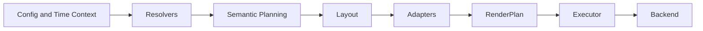

# Libration

Libration is a local-first, renderer-agnostic world time instrument.

It is a canonical reference implementation of a longitude-first global time visualization system. The product treats the world as a continuous 360 degree spatial structure, resolves one authoritative UTC instant per frame, and presents civil time through a selected reference frame without making political time zones the structural basis of the display.


## What Libration is

Libration is a precision-rendered desktop application for visualizing world time, map context, and future global scene layers.

Core product traits:

- Longitude-first structural model with 24 fixed 15 degree sectors.
- One authoritative UTC instant per frame.
- Reference-frame presentation for user-facing civil time.
- Screen-space display chrome separated from projection-space scene content.
- Renderer-agnostic `RenderPlan` pipeline.
- Curated, projection-valid map assets.
- SceneConfig-driven base map and layer composition.
- AGPL-3.0 user-freedom licensing.

Libration is independently developed and is not affiliated with any existing commercial time-map product.

## Current capabilities

Current implemented areas include:

- Tauri, React, TypeScript, Vite desktop app.
- Structured `LibrationConfigV2` persistence and normalization.
- Top-band display chrome with hour markers, tickmark tape, and NATO structural zone row.
- Structured hour-marker configuration under `chrome.layout.hourMarkers`.
- Text and procedural hour-marker realizations.
- Bundled font asset registry and Canvas font realization.
- Renderer-neutral `RenderPlan` primitives for text, rects, lines, paths, gradients, image blits, and raster patches.
- Canvas backend execution through bridge modules.
- SceneConfig-driven map scene.
- File-backed curated base-map catalog.
- Categorized base-map selector UI with grouped substrate families.
- Static and month-aware base-map families.
- Per-family base-map presentation controls for brightness, contrast, gamma, and saturation.
- Shared family-level presentation persistence across seasonal/month-aware raster variants.
- Map preview and attribution display for selected base-map families.
- Static and derived scene overlays.
- Solar analemma ground-track overlay.
- Solar day/night shading on the “Solar shading” layer, implemented as a continuous, attenuation-driven solar-altitude illumination field using civil/nautical/astronomical thresholds as semantic anchors.
- Twilight composition integrated directly into the same upstream planetary illumination raster as day/night (not a separate user-facing twilight layer).
- Non-emissive twilight behavior: atmospheric tint and attenuation modulate substrate visibility rather than adding artificial glow.
- Perceptually tuned lunar secondary illumination in the same upstream planetary illumination raster: moon phase, lunar altitude, and surface incidence gate a bounded cool additive field plus a secondary transmittance lift on the night mask, giving a broad directional moonlit read near high lunar incidence while daylight/early twilight stay strongly suppressed and new moon / moon-below-horizon stay effectively unchanged.
- Emissive night lights (NASA Black Marble–based composition raster) sampled upstream into that same planetary illumination raster, with presentation modes **Off / Natural / Enhanced / Illustrative** under Scene layers (default **Off**); durable `assetId` is catalog-backed and not surfaced as a base-map family.
- Polar illumination behavior derived from real seasonal solar geometry and Earth axial tilt.
- Canvas backend execution remains renderer-agnostic and only consumes the resulting `rasterPatch`.
- Runtime base-map image load failure fallback.

## Architecture in one sentence

Libration resolves product meaning upstream through configuration, resolvers, semantic planners, layout, and realization adapters, then emits backend-neutral render plans that the backend executes mechanically.



## Documentation map

Start here:

- [ARCHITECTURE.md](ARCHITECTURE.md) - stable system architecture.
- [PLAN.md](PLAN.md) - current phase, immediate priorities, and next execution slices.
- [AGENTS.md](AGENTS.md) - persistent AI co-engineering rules for ChatGPT and Cursor.
- [docs/PROJECT_STRATEGY.md](docs/PROJECT_STRATEGY.md) - product and project strategy.
- [docs/DEVELOPMENT_STRATEGY.md](docs/DEVELOPMENT_STRATEGY.md) - implementation criteria and engineering rules.
- [docs/ROADMAP.md](docs/ROADMAP.md) - completed and planned phases.
- [docs/FUTURE_FEATURES.md](docs/FUTURE_FEATURES.md) - retained feature backlog.
- [docs/AI_COENGINEERING.md](docs/AI_COENGINEERING.md) - how this project uses ChatGPT and Cursor.
- [docs/maps/MAP_ASSET_STRATEGY.md](docs/maps/MAP_ASSET_STRATEGY.md) - map sourcing and onboarding strategy.
- [docs/maps/MAP_ASSET_SOURCES.md](docs/maps/MAP_ASSET_SOURCES.md) - current map source inventory.

Note:

- The prior large spec archive was intentionally retired during documentation consolidation.
- Durable architecture intent now lives primarily in `ARCHITECTURE.md`, `PLAN.md`, the roadmap, and the focused strategy documents.
- New specs should only be reintroduced when they provide durable contract value rather than duplicating implementation detail.

## Development

Install dependencies:

```bash
npm install
```

Run the app:

```bash
npm run dev
```

Run tests:

```bash
npm test
```

Prepare map assets:

```bash
npm run maps:prep -- --help
```

Prepare font assets:

```bash
npm run fonts:prep
```

## Licensing

Libration is licensed under the GNU Affero General Public License v3.0.

The AGPL preserves the freedom to inspect, study, modify, share, and benefit from improvements to the software, including when the software is used over a network.
