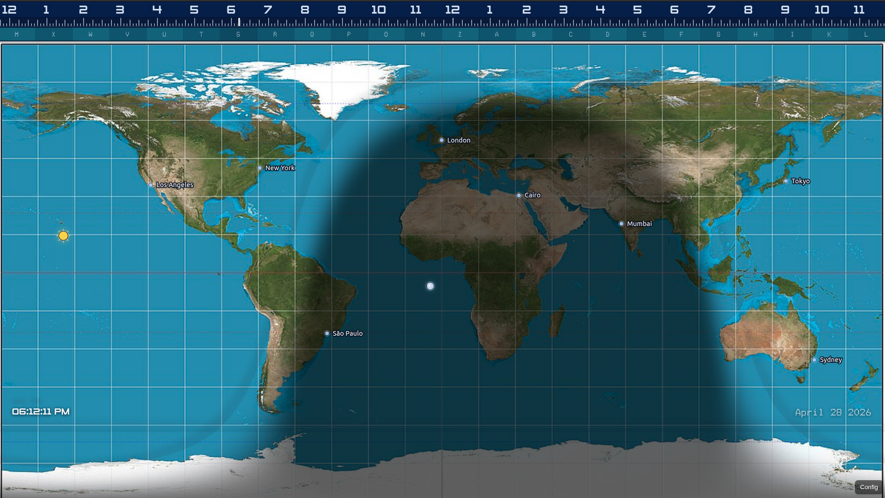
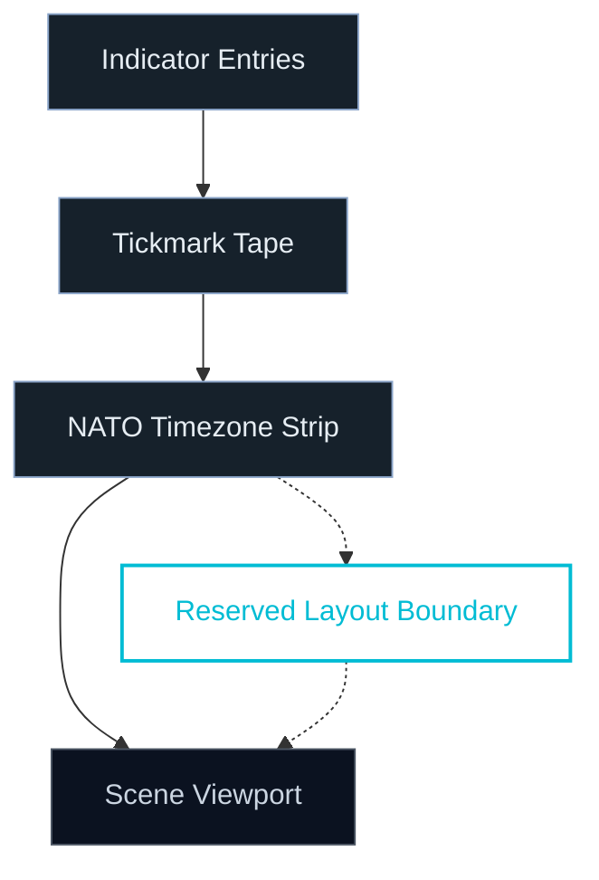
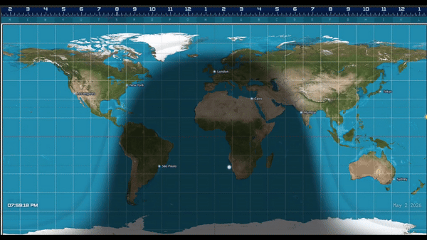
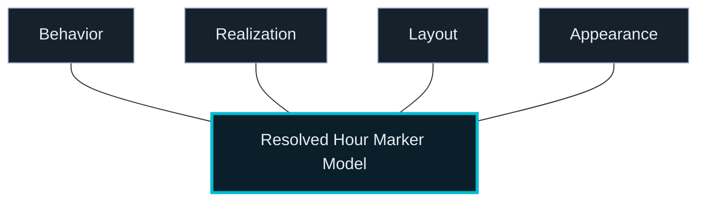
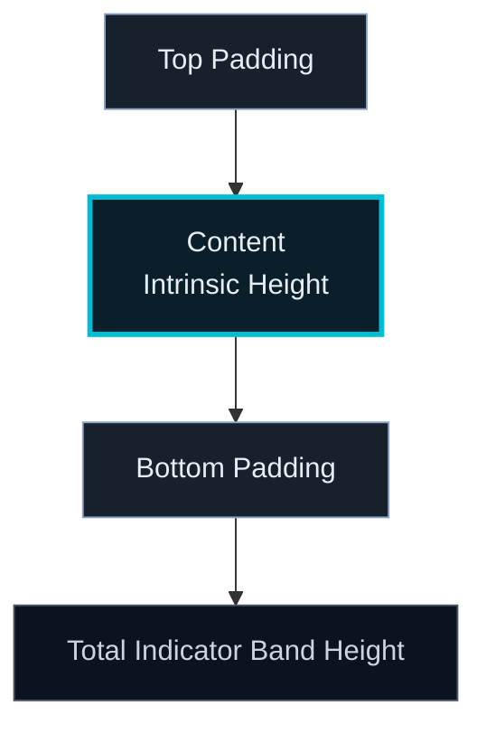
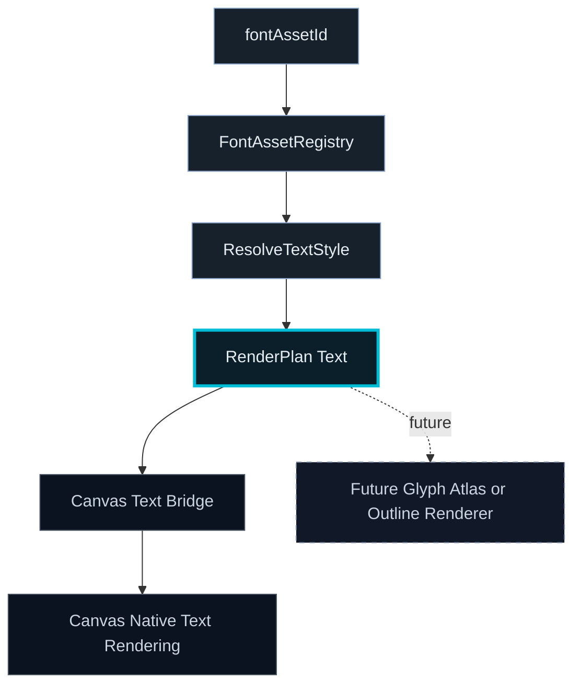
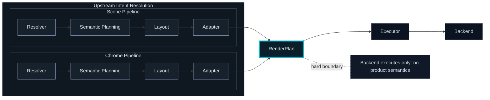
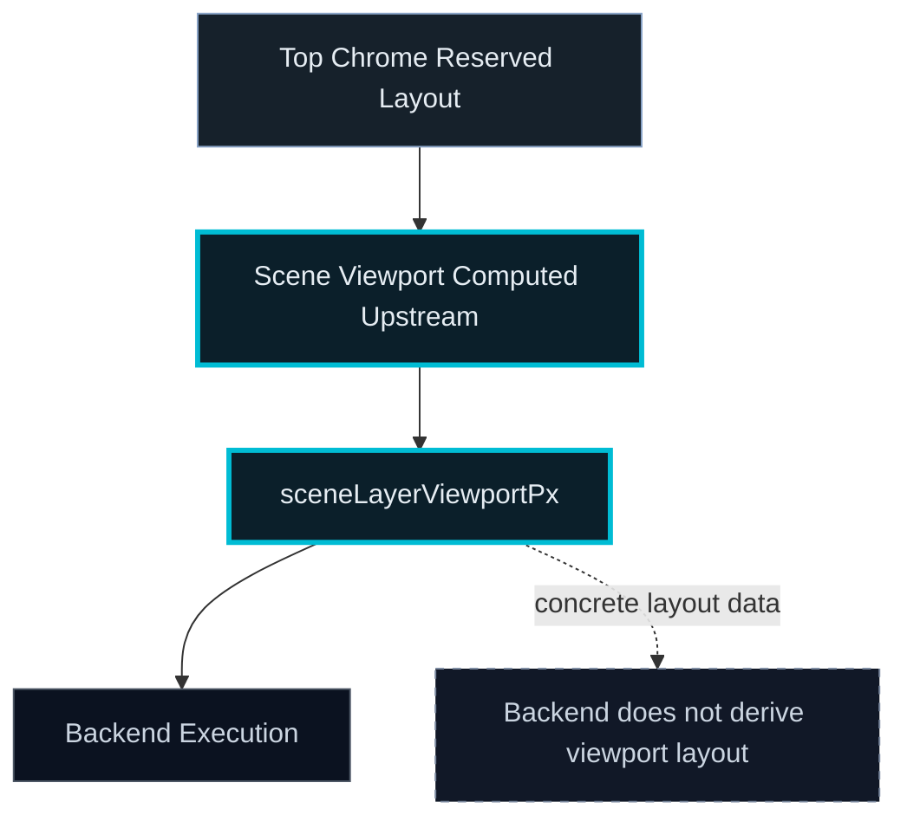

# Libration

## Overview

Libration is a canonical reference implementation of a longitude-first world time visualization system.



It uses:
- a longitude-first time model
- 24 fixed structural sectors (15° each)
- UTC as canonical time
- display-time derived via reference-time logic
- a renderer-agnostic rendering pipeline

It is a high-fidelity world time instrument built on a **render-plan architecture** and currently delivered as a local-first desktop application.


Libration resolves rendering intent upstream and emits a backend-agnostic RenderPlan for execution.

---

## Project Philosophy

Libration is intended to be a canonical, publicly accessible, user-freedom-preserving reference implementation of this system.

This project prioritizes the freedom of users to:
- 🔍 Inspect the software
- 🧠 Study how it works
- 🛠 Modify it
- 🔄 Share it
- 📈 Benefit from improvements made by others

To preserve those freedoms downstream, Libration is licensed under the **GNU Affero General Public License v3.0 (AGPL-3.0)**.

Libration is independently developed and is not affiliated with any existing commercial product.

---

## Current UI Direction

Top band consists of:
- Hour markers
- Tickmark tape (hour / 15 / 5)
- NATO timezone strip (continuous rectangular band)



Top chrome is composed in screen space and **reserves vertical layout**.  
The scene viewport begins strictly below the visible chrome stack.

The top instrument strip uses one built-in appearance for now; future tweaks will be direct config controls, not bundled palette presets.

Top chrome is now treated as real application layout:
- the top chrome stack reserves vertical space above the map
- the scene viewport begins below the visible top chrome
- hiding top-band areas reclaims that space instead of leaving map content hidden underneath chrome

Chrome editing is now organized by major area rather than one long mixed panel. Current major areas include:
- 24-hour indicator entries
- 24-hour tickmarks tape
- NATO timezone area

Each top-band area now has independent persisted visibility where applicable, including:
- `chrome.layout.hourMarkers.indicatorEntriesAreaVisible`
- `chrome.layout.tickTapeVisible`
- `chrome.layout.timezoneLetterRowVisible`

Recent simplification:
- top-band alignment and timing behavior are unchanged
- the present-time tick mark lives in the 24-hour tickmark tape only; it is no longer double-drawn into the upper indicator entries area


---

## Hour Marker Direction

Top-band hour markers now use a clean, explicit model:

- **Behavior** — how markers move or stay anchored
- **Realization** — text or procedural glyph mode
- **Layout** — size and placement semantics
- **Appearance** — realization-scoped styling layered on top



At semantic runtime, hour-marker **content** is still derived as part of the resolved plan (for example `hour24` vs `localWallClock`), but it is no longer treated as a persisted editor-owned axis.

Implemented realizations:
- **Text**
  - bundled font asset selection
  - size and styling overrides layered on top
- **Procedural glyphs**
  - analog clock markers
  - radial wedge
  - radial line

Bundled font inventory currently includes:
- Zeroes One
- Zeroes Two
- DSEG7Modern-Regular
- DotMatrix-Regular
- COMPUTER
- Flip Clock
- Kremlin

Hour markers now persist through a single structured config surface:

`chrome.layout.hourMarkers`

That model is authoritative for:
- editor authoring
- normalization
- runtime resolution
- persistence

### Indicator-band vertical model



**Total Height = intrinsic content height + top padding + bottom padding**

Padding affects spacing only. It does not change intrinsic text size, glyph size, or fitted marker geometry.

Where:
- intrinsic content height comes from text intrinsic sizing in text mode
- intrinsic content height comes from fitted geometry in glyph modes
- `contentPaddingTopPx` / `contentPaddingBottomPx` affect spacing only
- padding must never affect text size, glyph size, radius, or emitted marker scale
- Auto padding is intrinsic-based, not fixed-band/slack-based

The config popup exposes:
- **Content row padding (top)**
- **Content row padding (bottom)**

Empty values use Auto; numeric values are exact px overrides.

---

## Data Mode Default

On a fresh deploy or first application load, the default data mode is:

`static`

That default is defined at the canonical config layer and is only used when no persisted user configuration exists. Existing saved user state continues to take precedence.

The current data model is intentionally local-first:
- no live network feeds
- no background refresh

---

## Font / Typography Status



Bundled font assets resolve into backend-agnostic text intent first.  
Today, the active Canvas backend realizes that text through its Canvas text bridge and native Canvas text rendering path.

A future glyph-atlas or outline-based text renderer would attach downstream of the same RenderPlan boundary.

The project has:
- a preprocessed font asset manifest
- runtime font asset lookup by stable ID
- semantic typography roles
- glyph/text emission through `RenderPlan`

Current Canvas rendering still uses **native Canvas text realization** at the backend edge, but bundled fonts are loaded and registered at runtime so changing `fontAssetId` visibly changes output in the active Canvas backend.

So today the live text path is:

`fontAssetId -> FontAssetRegistry -> resolveTextStyle -> RenderPlan text -> Canvas text bridge -> Canvas native text rendering`

The project does **not yet** use a custom glyph-outline or atlas-based text renderer.

---

## Architecture



Libration resolves scene and chrome intent upstream, converts both into a shared **RenderPlan**, and only then hands execution to the backend.

The backend executes drawing instructions only. It does not derive product semantics, layout policy, or chrome reservation rules.

`Resolver / Planner / Layout / Adapter → RenderPlan → Executor`

All rendering intent is resolved before backend execution.



The scene viewport for visible map content is also resolved upstream and passed to the backend as concrete layout data (`sceneLayerViewportPx`), so backends do not derive top-chrome reservation rules themselves.

Current backend:
- Canvas

Planned future backend:
- native / NVIDIA RTX-class renderer

---

## Status

Initial public release: **v1.0.0**  
Architecture stable.  
Top-band hour-marker runtime migration complete for the supported production path.  
Hour-marker editor and persistence migration complete.  
Typography + glyph subsystem implemented.  
Canvas bundled-font realization working.  
Current engineering focus: feature-forward top-band chrome work on top of the completed structured hour-marker model.

---

## Saved Configuration — Hour Markers (Breaking Change)

Hour-marker persistence now requires:

`chrome.layout.hourMarkers`

Older saved configs that only used legacy flat hour-marker fields are no longer compatible. This was an intentional full cutover.

---

## Run

```bash
npm install
npm run tauri dev
```

---

## License

This project is licensed under the **GNU Affero General Public License v3.0 (AGPL-3.0)**.

The AGPL is used so that users retain access to the source code and improvements made to the software, including in network-hosted deployments.
