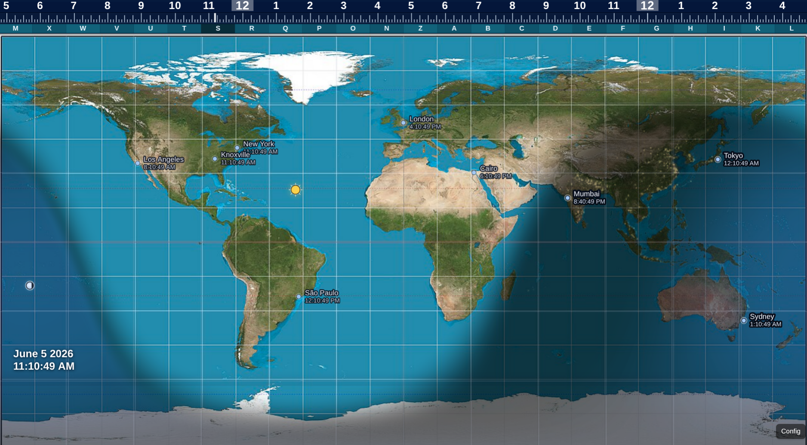
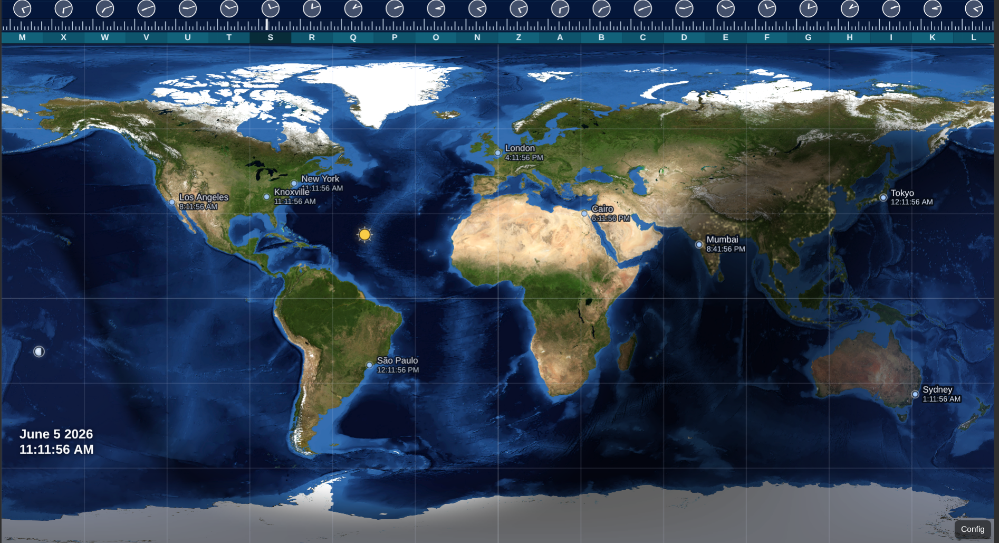
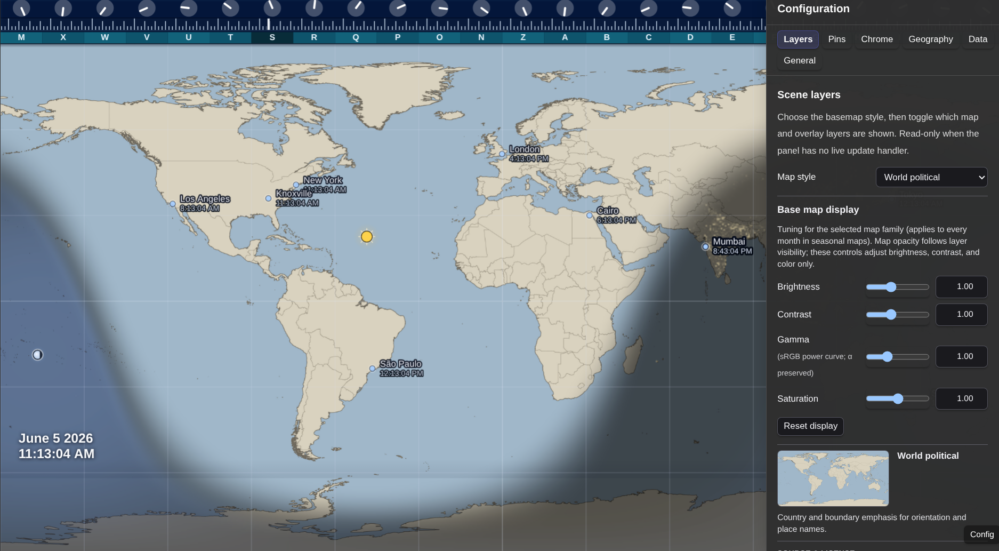

# Libration

Libration is a longitude-first world time instrument.

It treats the world as a continuous 360° spatial structure rather than a set of political zones: one authoritative UTC instant is resolved per frame, the globe is presented as an equirectangular strip, and civil time is read against that strip through a selected reference frame. Political time zones are shown, but they are not the structural basis of the display.





## What it does

The window is a single canvas with two parts.

**Screen-space chrome** across the top is the instrument: 24 fixed 15° structural longitude columns, a NATO structural-zone letter row, a tick tape, and a row of circular hour markers that slides continuously with civil time against an anchored read point. A readout runs along the bottom.

**Projection-space scene** below it is the world: a selectable base map with eleven curated substrate families — natural-colour, topographic, political, geological, bathymetric, land cover, climate, population — three of them month-aware, plus overlays for a graticule, city pins, the solar analemma, and subsolar and sublunar markers.

Over all of it sits **planetary illumination**: day and night, continuous twilight with atmospheric tint, moonlight varying with lunar phase and altitude, and emissive human-made night lights, all composed upstream into a single raster. Polar behaviour follows real solar geometry, so midnight sun and polar night simply happen.

Three **live data feeds** can be enabled — cloud and infrared imagery, earthquakes, and the ISS ground track — each with an offline fixture fallback, and none of them touching the render path.

Configuration is a six-tab panel toggled with the `C` key, persisted to browser storage as you change it.

## Platform posture

Libration currently runs as a **browser-first single-page application**: React, TypeScript, Vite, Canvas 2D, and browser `localStorage`.

A configured **Tauri 2 shell is present** in `src-tauri/` for desktop packaging and integration, but it is **not currently load-bearing** — no application code imports Tauri APIs, and the application behaves identically in a plain browser. Whether the shell becomes load-bearing is an open question, not a settled one. See [ADR 0006](docs/decisions/0006-browser-first-spa-with-non-load-bearing-tauri-shell.md).

The application works fully offline. Maps, fonts, and fallback data are bundled.

## Running it

```bash
npm install
npm run dev
```

The dev server runs at **http://localhost:1420** on a fixed port. Open it in a browser; no Rust toolchain is needed.

Press `C` to open the configuration panel, `Escape` to close it.

## Verifying it

```bash
npm test           # Vitest suite
npm run build      # tsc type-check, then production build
```

Tests are colocated with the modules they cover. Because rendering intent is a declarative `RenderPlan`, most visual geometry is verified at plan level rather than against pixels.

## Asset tooling

```bash
npm run maps:prep -- --help    # onboard a curated base-map family
npm run fonts:prep             # regenerate the bundled font manifest
```

## Documentation

| Document | Owns |
|----------|------|
| [`ARCHITECTURE.md`](ARCHITECTURE.md) | Durable boundaries and invariants |
| [`docs/IMPLEMENTATION.md`](docs/IMPLEMENTATION.md) | How the current code actually works |
| [`docs/decisions/`](docs/decisions/) | Why the durable choices were made |
| [`docs/PROJECT_STRATEGY.md`](docs/PROJECT_STRATEGY.md) | Product thesis and design principles |
| [`docs/FUTURE_FEATURES.md`](docs/FUTURE_FEATURES.md) | Speculative and future ideas |
| [`docs/maps/MAP_ASSET_SOURCES.md`](docs/maps/MAP_ASSET_SOURCES.md) | Asset provenance, licensing, processing |
| [`docs/maps/MAP_ASSET_STRATEGY.md`](docs/maps/MAP_ASSET_STRATEGY.md) | Map curation and onboarding policy |
| [`docs/specs/scene/dynamic-data-lifecycle.md`](docs/specs/scene/dynamic-data-lifecycle.md) | Dynamic-data contract |
| [`AGENTS.md`](AGENTS.md) | Entry contract for AI coding agents |
| [`docs/history/`](docs/history/) | Archived planning and execution records |

Reading order for someone new: this file, then `ARCHITECTURE.md`, then `docs/IMPLEMENTATION.md`.

Documentation modernization is in progress. `docs/STATE.md` (current development state), `docs/ROADMAP.md` in its rewritten form, `docs/WORKFLOW.md`, and `docs/VISUAL_VERIFICATION.md` are reserved and not yet created; `docs/ROADMAP.md` currently holds transitional pre-modernization content.

## Licensing

Libration is licensed under the **GNU Affero General Public License v3.0**.

The AGPL preserves the freedom to inspect, study, modify, share, and benefit from improvements to the software, including when the software is used over a network.

Libration is independently developed and is not affiliated with any existing commercial time-map product.
