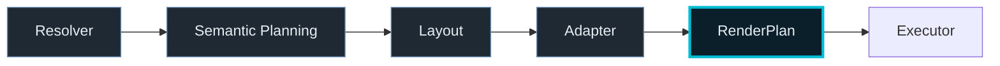
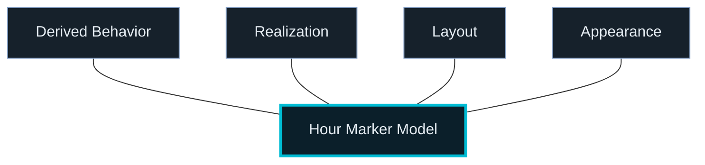

# Cursor Workflow

## Core Principle

All rendering logic must be expressed via semantic resolvers, layout stages, realization adapters, and `RenderPlan` builders upstream of execution.

Rendering intent is fully resolved before execution. Backends execute only.

---

## Responsibilities

### Cursor
- implement semantic planners and layout stages
- implement UI/editor restructuring work when a surface needs it
- activate the existing font, typography, and glyph system in live renderer paths
- remove obsolete compatibility code when a migration slice is complete
- implement feature-forward work on top of already-cleaned runtime contracts
- preserve repo-wide AGPL license headers in source files where applicable

### ChatGPT
- architecture and design direction
- representation and editor system design
- integration guidance when a feature reveals a real architectural gap

---

## Current Focus

- top-band hour markers are now the reference example of aligned runtime, editor, and persistence architecture
- runtime migration is complete for the supported production path
- editor migration is complete for hour markers
- persistence migration is complete for hour markers

- preserve the truthful top-band hour-marker model:
  - realization
  - derived effective behavior (text → tapeAdvected; procedural → staticZoneAnchored)
  - layout
  - appearance
  - derived semantic content where required at runtime
- preserve the invariant that indicator-band padding affects spacing only and never marker scale
- preserve the independent top-band visibility controls for indicator entries, tick tape, and NATO row
- do not reintroduce boxed hour numerals on the tick tape for clock/procedural modes
- continue renderer-agnostic feature work without resurrecting migration scaffolding
- preserve the intentional first-load default of `AppConfig.data.mode = "static"` unless explicitly changing product behavior
- maintain public-repo coherence with AGPL-3.0 licensing and canonical-reference positioning

---

## Rules

### DO
- keep rendering declarative
- keep representation and behavior choices upstream of execution
- use semantic roles instead of raw font references in unrelated component logic
- treat non-font glyphs as first-class renderables where appropriate
- prefer dedicated editors when a chrome surface outgrows monolithic UI ownership
- keep config, policy, and type ownership flowing downstream (config → glyphs → renderer), never the reverse
- keep style layered over representation and asset choice
- delete obsolete migration code once a slice is complete
- preserve existing AGPL headers when editing covered source files
- add appropriate AGPL headers to new covered source files when consistent with repo practice

### DO NOT
- put product semantics in backend
- hardwire browser font behavior into architecture
- reintroduce top-band text-style preset concepts
- let decorative fonts leak into core instrument roles accidentally
- keep doing speculative architecture cleanup without a concrete feature blocker
- restore degraded runtime fallback behavior for hour markers
- resurrect legacy flat hour-marker persistence
- generalize the hour-marker solution to other surfaces without feature pressure
- remove or duplicate license headers during routine edits
- let row or band height or padding influence marker scale

---

## Rendering Rule

`Resolver → Semantic Planning → Layout → Adapter → RenderPlan → Executor`

Backends realize resolved intent only.

Current Canvas text realization is backend-specific and still uses native Canvas text APIs behind the bridge, with bundled fonts loaded and registered at runtime.

---

## Current State

Initial public release (v1.0.0) complete  
Architecture complete enough for feature-forward work  
Top-band hour-marker runtime migration complete for the supported production path  
Hour-marker editor and persistence migration complete  
Typography and glyph support implemented  
Canvas bundled-font realization working  

Current task:
- continue top-band feature and styling work on top of the completed structured hour-marker model
