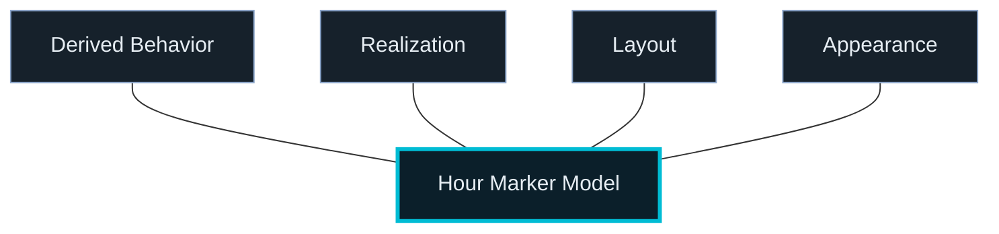
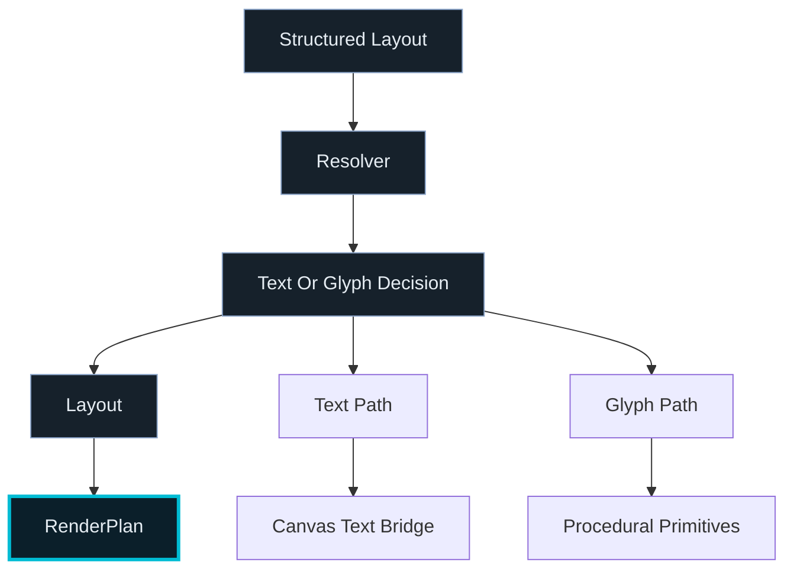

# LibrationConfig v2 — Phase 0


## SceneConfig / Base Map Update

`LibrationConfigV2.scene` is now an authoritative scene domain in addition to the structured chrome model.

The scene domain persists:

- `projectionId`
- `viewMode`
- `baseMap`
- ordered `layers[]`

For base maps, the persisted config stores only the selected family id and presentation controls:

```ts
scene.baseMap.id
scene.baseMap.visible
scene.baseMap.opacity
scene.baseMap.presentation?
```

Concrete raster URLs, including month-specific imagery, are resolved at runtime from the bundled base-map catalog and product time. Month-aware map families do not persist month file paths. Catalog defaults may seed base-map presentation, while SceneConfig stores user/preset overrides.

---

## Update

### Chrome hour-marker reality today

`chrome.layout.hourMarkers` is now the sole persisted hour-marker config surface.

Hour-marker persistence is no longer expressed through legacy flat `chrome.layout` fields.

Top-band hour-marker rendering now flows through a resolved semantic model:
- structured `chrome.layout.hourMarkers`
- `resolveEffectiveTopBandHourMarkers`
- semantic planner
- layout
- realization adapter
- `RenderPlan`


There is no remaining flat compatibility layer for hour markers in normalization, persistence, or runtime resolution.

---

## Current Direction

The chrome config has evolved beyond single-axis appearance control.

For hour markers, persistence, normalization, editor authoring, and runtime resolution are now aligned on one structured model.

### Important separation
- Config defines intent only
- Resolver produces the effective hour-marker model
- Semantic planning and layout derive runtime meaning
- Typography roles and glyph policies resolve text/glyph realization
- Rendering is derived via `RenderPlan`
- Raw font filenames are not the durable config surface
- Font asset selection is distinct from procedural glyph selection
- Style is layered over representation and asset choice

---

## Structured Hour-Marker Model

Hour markers persist under:

`chrome.layout.hourMarkers`

Conceptually, the persisted model carries:
- realization choice
- layout sizing
- content-row padding overrides
- indicator entries area background color intent
- optional noon/midnight customization intent for the upper indicator entries strip
- realization-scoped appearance overrides

Derived effective/runtime concerns now include:
- behavior derived from realization kind:
  - text → `civilPhased`
  - non-text/procedural → `civilColumnAnchored`
- runtime content derived from that intent rather than persisted as a second source of truth



Top-band visibility that sits alongside this model is also structured in chrome layout state, including:
- `chrome.layout.hourMarkers.indicatorEntriesAreaVisible`
- `chrome.layout.tickTapeVisible`
- `chrome.layout.timezoneLetterRowVisible`

Lower-left bottom HUD (reference-city date/time only, not map layers) uses:
- `chrome.layout.bottomInformationBarVisible`
- `chrome.layout.bottomTimeStackShowDate` / `chrome.layout.bottomTimeStackShowTime`
- `chrome.layout.bottomTimeShowSeconds`
- `chrome.layout.bottomTimeStackSizeMultiplier` and optional `chrome.layout.bottomReadoutFontAssetId`

The HUD is no longer a multi-clock stack. It renders only the reference-city date and one time line; in `utc24`, the date remains reference-city civil while the time line is formatted in UTC.

Additional strip-scoped structure now lives under `chrome.layout.hourMarkers` as part of the same authoritative model, including:
- indicator entries area background color intent
- resolver-derived effective foreground usage downstream of that background
- optional `noonMidnightCustomization` with bounded expression modes for the upper strip only
- leveled procedural appearance overrides for analog, radial line, and radial wedge surface layers
- UTC runtime coercion to text-only realization when `chrome.displayTime.topBandMode === "utc24"`

---

## Font / Glyph Clarification

Top-band hour-marker text currently resolves through:

`structured chrome layout -> resolveEffectiveTopBandHourMarkers -> semantic text realization -> typography/intrinsic resolver -> layout -> realization adapter -> RenderPlan text -> Canvas text bridge`

Procedural glyphs resolve through:

`structured chrome layout -> resolveEffectiveTopBandHourMarkers -> semantic glyph realization -> glyph policy/spec -> layout -> procedural glyph -> RenderPlan primitives`



The current config does **not** point directly at raw TTF files or renderer-owned glyph geometry.

Canvas remains responsible for final text realization in the current backend, and bundled font realization is now working for that path.

Scene/chrome composition now also preserves a renderer-agnostic boundary: the visible map strip viewport is derived upstream and passed to the backend as resolved layout data rather than having the backend derive top-chrome reservation math on its own.

---

## Chrome `displayTime` intent (reference frame)

`chrome.displayTime` stores **intent** only: civil IANA zone source, formatting-only hour-label mode, and read-point meridian policy.

Runtime derives `TimeBasis`, `ReferenceFrame`, `CivilProjection`, and `ReadPoint` in the chrome resolver. The editor labels these as a single reference-frame story (zone + meridian policy); display mode does not alter tape geometry or registration.

---

## Status

The truthful top-band hour-marker runtime contract is in place.

The truthful top-band hour-marker editor contract is in place.

The truthful top-band hour-marker persistence contract is in place.

The truthful indicator-band vertical model is in place:
- intrinsic content height is solved independently
- padding affects spacing only
- visible indicator-band height follows intrinsic content height plus resolved top/bottom padding
- Auto padding is intrinsic-based, not slack-based
- padding never affects marker scale

Current follow-on config/editor work should focus on:
- adding new hour-marker controls only when a concrete feature requires them
- preserving the structured-only `chrome.layout.hourMarkers` contract
- treating strip-scoped indicator-entry controls as part of that same structured contract rather than as ad hoc render-time flags
- treating the hour-marker editor pattern as the finished reference example rather than reopening migration work
- reusing the pattern elsewhere only after feature pressure justifies it

---

## Breaking Change

Hour-marker persistence now requires:

`chrome.layout.hourMarkers`

Older saved configs that only contained legacy flat hour-marker fields are no longer compatible. This was an intentional full cutover.
