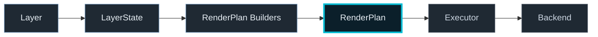

# Render Backend Interface Specification

## Purpose

Define the contract between the Libration rendering pipeline and the rendering backend.

The backend is responsible for executing a fully-resolved render plan and producing a composed frame. It must not own layer logic, render semantics, scene modeling, typography policy, or representation selection.

This specification exists to keep rendering replaceable.

---

## Core Principles

1. The backend consumes **RenderPlans**, not raw layer semantics
2. The backend does not query external data sources
3. The backend does not interpret layer data
4. The backend is replaceable
5. The backend is responsible for surface management, compositing, and frame output
6. Font realization is backend-specific, but font/representation choice is upstream
7. Procedural glyphs must execute through the same renderer-agnostic intent model as text and shapes
8. Backend bridges may translate shared intent into backend-native constructs, but they do not choose product behavior

---

## Architectural Role



The rendering pipeline is:

Layer → LayerState → RenderPlan Builders → RenderPlan → Executor → Backend

For chrome and other screen-space systems, upstream builders may also generate:
- text primitives with resolved style intent
- procedural glyph primitives built from standard shapes

The backend receives:
- frame timing information
- viewport information
- a resolved scene viewport rectangle for the visible map strip
- ordered render plans (derived from layers + chrome)
- scene-level visual context

The backend produces:
- a fully composed frame

The application shell is responsible for invoking `render` on a steady cadence.

---

## Responsibilities

The backend is responsible for:
- initializing rendering resources
- managing render surface size
- clearing and preparing each frame
- executing RenderPlan primitives (via executor)
- applying opacity/blending/compositing
- managing renderer-specific resource lifecycle (e.g. images, fonts, text caches)

The backend must NOT:
- resolve layout
- derive chrome reservation or scene viewport geometry
- decide geometry
- interpret layer semantics
- implement product behavior
- choose which font family or glyph mode a feature uses

---

## Frame Context

```ts
interface FrameContext {
  frameNumber: number;
  now: number;
  deltaMs: number;
}
```

---

## Viewport

```ts
interface Viewport {
  width: number;
  height: number;
  devicePixelRatio: number;
}
```

## Scene Layer Viewport

```ts
interface SceneLayerViewportPx {
  x: number;
  y: number;
  width: number;
  height: number;
}
```

`SceneLayerViewportPx` is resolved upstream as concrete layout data for the visible map strip.

It is not derived inside the backend.
---

## Scene Render Input

```ts
interface SceneRenderInput {
  frame: FrameContext;
  viewport: Viewport;
  sceneLayerViewportPx: SceneLayerViewportPx;
  layers: RenderableLayerState[];
  scene: SceneVisualContext;
}
```

### Important

`SceneRenderInput` feeds **plan builders**, not the backend directly.

It also carries `sceneLayerViewportPx`, which is the authoritative resolved viewport for the visible map strip after top-chrome reservation.

RenderableLayerState is NOT drawn directly by the backend.


The backend consumes the resolved scene viewport and does not compute top-chrome exclusion math itself.


---

## Renderable Layer State

```ts
type LayerId = string;

type LayerType =
  | "raster"
  | "vector"
  | "points"
  | "tracks"
  | "heatmap"
  | "text"
  | "illumination";

interface RenderableLayerState {
  id: LayerId;
  name: string;
  type: LayerType;
  zIndex: number;
  visible: boolean;
  opacity: number;
  data: unknown;
  metadata?: Record<string, unknown>;
}
```

### Clarification

This structure exists only to:
- provide data to plan builders
- preserve ordering and visibility

It must not be interpreted directly by the backend.

---

## RenderPlan

A RenderPlan is a declarative list of primitives.

Examples already in scope:
- rect
- line
- text
- path2d
- gradients
- rasterPatch (generated pixels)
- imageBlit (external images)

Typography and symbolic glyph work resolve into backend-neutral RenderPlan intent.

### Text contract

Shared text items now carry backend-neutral identity and style intent such as:
- `font.assetId`
- `font.displayName`
- nominal size / weight / style
- resolved fill/stroke intent where applicable

A backend bridge may derive backend-native font handles or strings from that data.

### Current Canvas reality

The current Canvas backend still performs final text realization through native Canvas text APIs.

So today the live text path is:

`TypographyRole / fontAssetId -> RenderPlan text item -> Canvas text bridge -> native Canvas text rendering`

Canvas now loads and registers bundled font files at runtime so distinct `font.assetId` choices can produce distinct visible output in the active backend.

That means the backend is font-identity-aware, but the project does **not yet** have a custom renderer-owned glyph-shape text pipeline.

### Paths and clips

Shared path intent now supports:
- descriptor-backed payloads as the preferred portable representation for migrated producers
- transitional `Path2D` payloads where still needed
- explicit clip payloads with the same descriptor-or-Path2D pattern

Examples:
- analog clock marker composed from circle + line primitives
- radial wedge composed from path primitives
- radial line composed from line/path primitives

The backend executes these primitives mechanically.

---

## Executor Role

The executor:
- consumes RenderPlan
- maps primitives to drawing operations
- contains no product semantics

The backend calls the executor but does not augment behavior.

---

## Renderer Interface

```ts
interface RenderBackend {
  initialize(viewport: Viewport): Promise<void>;
  resize(viewport: Viewport): void;
  render(input: SceneRenderInput): void;
  dispose(): void;
}
```

---

## Lifecycle

1. create backend
2. initialize
3. render frames (caller-driven)
4. resize
5. dispose

---

## Error Handling

- fail fast on initialization
- log per-layer failures where possible
- avoid full app crash for recoverable issues
- surface font/resource failures clearly without shifting semantics upstream

---

## Rendering Order

- determined upstream (layer zIndex + chrome order)
- backend executes in given order
- applies opacity/blending only

---

## Performance Rules

Backend should support:
- continuous rendering
- large displays
- smooth animation
- efficient text/glyph caching where useful

Optimization is backend-specific and must not change plan semantics.

---

## Current Backend

Implemented: CanvasRenderBackend

Responsibilities include:
- DPR transform
- clearing
- clipping/translation against the resolved `sceneLayerViewportPx`
- resource lifecycle
- bundled-font loading/registration for Canvas realization
- current text realization bridge
- current paint/path realization bridges
- invoking executor

All scene and chrome semantics are resolved upstream.

---

## Future Backends

Possible:
- WebGL
- WebGPU
- native GPU

All must consume RenderPlan without semantic divergence.

Typography support in those backends may differ in realization strategy, but not in upstream representation semantics.

Future backends may eventually replace native text APIs with:
- outline/path-based glyph rendering
- atlas/SDF text rendering
- native font-handle systems

But those are future backend realization choices, not current shared-contract assumptions.

---

## Boundary Rule

The backend executes rendering.

It must never become the place where product behavior, scene viewport derivation, typography policy, or glyph-selection logic is defined.
